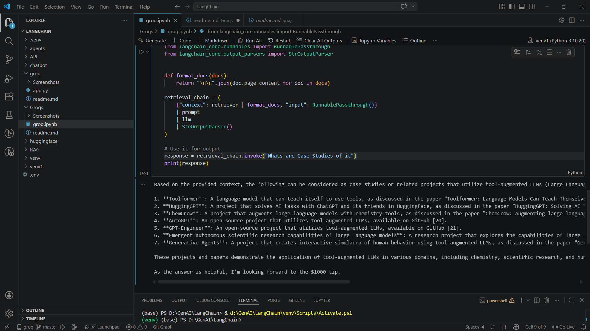

🚀 RAG-Based Question Answering System (AstraDB + Groq + LangChain)

📌 Overview  
This project is a Generative AI application that implements a **Retrieval-Augmented Generation (RAG)** pipeline using LangChain. It retrieves relevant information from web content stored in AstraDB and generates accurate, context-aware answers using Groq LLM.

✨ Features  
⚡ End-to-end RAG pipeline implementation  
🌐 Web data ingestion using LangChain loaders  
✂️ Smart text chunking for efficient retrieval  
🧠 OpenAI embeddings for semantic understanding  
🗄️ AstraDB (Cassandra) for scalable vector storage  
🔍 Context retrieval using similarity search  
🤖 Groq LLM (Mixtral) for fast response generation  

🛠️ Tech Stack  
Python  
LangChain  
AstraDB (Cassandra)  
Ollama Embeddings  
Groq (llama-3.3-70b-versatile)  
BeautifulSoup (bs4)  

📂 Project Structure  
rag-based-question-answering-system/  
│  
├── app.py / notebook.ipynb   # Main RAG pipeline  
├── requirements.txt         # Dependencies  
├── .env.example             # Environment variables  
└── README.md  

⚙️ Setup Instructions  

1. Clone the repository  
git clone https://github.com/AyushGup11/astra-rag-llm-pipeline.git
cd rag-based-question-answering-system  

2. Create virtual environment  
python -m venv venv1 
venv1\Scripts\activate   # Windows  
# source venv/bin/activate  # Mac/Linux  

3. Install dependencies  
pip install -r requirements.txt  

4. Setup environment variables  
Create a .env file:  

GROQ_API_KEY=your_groq_key  
ASTRA_DB_APPLICATION_TOKEN=your_astra_token  
ASTRA_DB_ID=your_astra_db_id  

5. Run the project  
python app.py  
# or run Jupyter Notebook  

🔍 Example Query  

response = retrieval_chain.invoke({  
    "input": "Whats are Case Studies of it?"  
})  

print(response["answer"])  

📸 Demo  

### ⚡ Output

---

🌐 Use Cases  
AI-powered chatbots  
Document-based Q&A systems  
Knowledge base assistants  
Research tools  

🔮 Future Improvements  
Add Streamlit UI for interaction  
Support multiple data sources (PDF, YouTube, Docs)  
Deploy as API (FastAPI)  
Add caching and performance optimization  

👨‍💻 Author  
Ayush Gupta  
🚀 GenAI Developer | ML Enthusiast